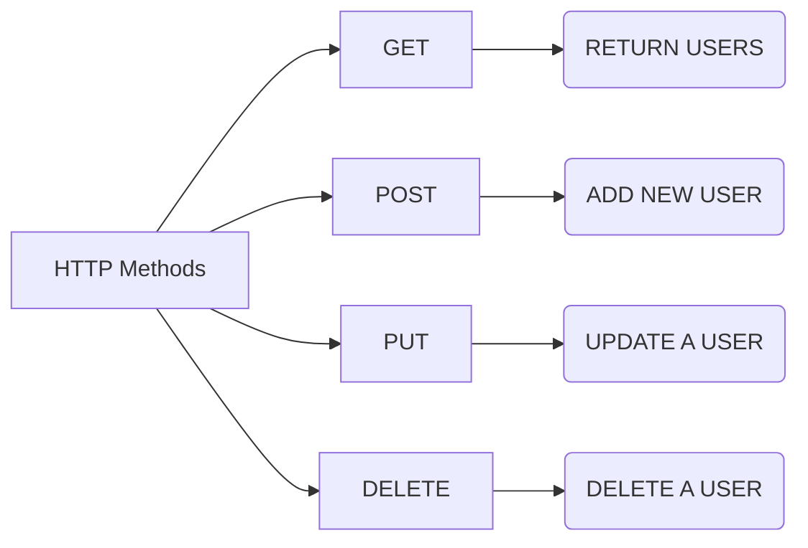
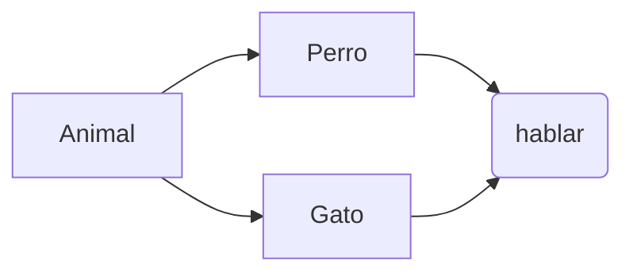

1.	# ¿Para qué usamos Clases en Python?

Las clases en Python se utilizan como **moldes** o **plantillas** para crear objetos, permitiendo organizar el código mediante la programación orientada a objetos (POO). Sirven para agrupar datos (atributos) y comportamientos (métodos) relacionados en una sola entidad, lo que facilita la reutilización, estructura y mantenimiento del código. 

## Principales usos y beneficios:
*	**Creación de objetos (Instanciación)**: Permiten definir estructuras de datos complejas que luego pueden instanciarse (crearse) múltiples veces, cada una con sus propios valores, pero con la misma estructura y comportamiento.
*	**Encapsulación**: Agrupan datos y funciones, protegiendo la información y ocultando la complejidad interna.
*	**Reutilización de código**: A través de la herencia, las clases permiten crear nuevas clases basadas en otras existentes, reutilizando sus métodos y atributos.
*	**Organización y mantenibilidad**: Ayudan a estructurar proyectos grandes, haciendo el código más ordenado, legible y fácil de actualizar.
*	**Modelado del mundo real**: Se utilizan para representar entidades reales o abstractas en el sistema, como un *Usuario*, un *Producto*, o un *Coche*, definiendo sus características (*color*, *marca*) y acciones (*frenar*, *acelerar*). 

Por ejemplo, se usaría una clase *Contacto* en una agenda para gestionar el *nombre*, *teléfono* y *correo* de cada persona, en lugar de manejar múltiples variables sueltas.

## Diferencia clave: Clase vs. Objeto:
**Clase**: Es el plano arquitectónico de una casa (la idea abstracta).
**Objeto**: Es la casa física construida con ese plano (una instancia concreta con sus propios colores y habitantes).


2.	# ¿Qué método se ejecuta automáticamente cuando se crea una instancia de una clase?

El método que se ejecuta automáticamente al crear una instancia de una clase es el **constructor**. Es un método especial diseñado para inicializar los atributos y configurar el estado inicial del nuevo objeto inmediatamente después de que se asigna memoria para él. 

*	**Nombre**: Generalmente tiene el mismo nombre que la clase (como en **Java/C#**) o un nombre especial como **__init__** (Python).
*	**Función**: Se utiliza para asignar valores predeterminados, establecer parámetros iniciales o preparar recursos necesarios para el objeto.
*	**Ejecución**: Se invoca automáticamente al usar la palabra clave new o al instanciar la clase.
*	**Constructor por defecto**: Si no se define uno, la mayoría de los lenguajes proporcionan un constructor vacío por defecto. 

Ejemplo:
>python
```
class Persona:
    def __init__(self, nombre, edad):
        # Inicialización de atributos
        self.nombre = nombre
        self.edad = edad

    def saludar(self):
        print(f"Hola, soy {self.nombre} y tengo {self.edad} años.")

# Crear una instancia (constructor invocado automáticamente)
p1 = Persona("Ana", 30)
p1.saludar()
```

## Puntos clave:
*   **Sintaxis**: Se define como def __init__(self, ...):.
*   **self**: Es el primer parámetro obligatorio y referencia al objeto que se está creando.
*   **Parámetros**: Pueden recibir argumentos para personalizar el objeto al crearlo.
*   **Automático**: No se llama directamente; nombre_clase() invoca __init__.

3.	# ¿Cuáles son los tres verbos de API?

Los tres verbos fundamentales (métodos *HTTP*) en una API REST, esenciales para las operaciones CRUD, son: **GET** (leer/obtener datos), **POST** (crear nuevos datos) y **DELETE** (eliminar datos).

*	**GET**: Recupera información o recursos del servidor sin modificarlos.
*	**POST**: Envía datos al servidor para crear un nuevo recurso.
*	**DELETE**: Elimina un recurso específico del servidor.




4.	# ¿Es MongoDB una base de datos SQL o NoSQL?

MongoDB es una base de datos NoSQL (no relacional) orientada a documentos. A diferencia de las bases de datos SQL tradicionales que usan tablas y filas, MongoDB almacena información en documentos flexibles similares a JSON (llamados BSON), lo que permite manejar datos no estructurados o semiestructurados de manera eficiente y escalable. 

## Características principales de MongoDB como NoSQL:
*	**Modelo de Documentos**: Los datos se organizan en colecciones de documentos (no tablas y filas).
*	**Esquema Flexible**: No requiere un esquema predefinido, lo que facilita cambiar la estructura de los datos sin afectar la base de datos completa.
*	**Alto Rendimiento y Escalabilidad**: Diseñada para grandes volúmenes de datos y escalado horizontal mediante fragmentación (*sharding*).
•	**MongoDB Query Language (MQL)**: Utiliza su propio lenguaje de consulta, diferente del SQL tradicional. 

Es considerada la base de datos NoSQL más popular debido a su flexibilidad y rendimiento en aplicaciones modernas.


5.	# ¿Qué es una API?

Una API (Interfaz de Programación de Aplicaciones) es un conjunto de reglas y protocolos que permite que dos aplicaciones de software se comuniquen entre sí, intercambiando datos y funcionalidades de forma estandarizada. Actúa como un intermediario —similar a un camarero en un restaurante— que toma una solicitud, la lleva al sistema y trae la respuesta de vuelta, facilitando el desarrollo y la integración de aplicaciones.

## Aspectos clave de las API:
*	**Funcionamiento**: Permiten que una aplicación utilice funciones de otra sin necesidad de conocer cómo está implementado el código internamente.
*	**Componentes**: Se basan en solicitudes (peticiones) y respuestas. Las más comunes hoy en día son las 
API Web (o REST), que funcionan a través de internet usando HTTP.
*	**Tipos de API**:
    *	**Privadas**: Uso interno exclusivo dentro de una empresa.
    *	**De partners**: Compartidas con socios comerciales específicos.
    *	**Públicas**: Disponibles para que cualquier desarrollador las utilice (ej. Google Maps, Twitter).
*	**Ejemplos cotidianos**: Cuando una app móvil muestra el clima, cuando inicias sesión con Facebook en otra web, o cuando pagas con tarjeta en una tienda online, hay una API trabajando de fondo. 

En resumen, las API son la columna vertebral del software moderno, permitiendo la integración de sistemas, la automatización y la innovación al reutilizar servicios existentes.

## ¿Cuándo utilizar una API?
Cabe señalar que se puede proporcionar tanto un volcado de datos como una API; y son los usuarios quienes deben elegir lo que más les conviene.

Si tienes datos que deseas compartir con el mundo, crear una API Web es una forma de hacerlo.

Sin embargo, las API no siempre son la mejor forma de compartir datos con los usuarios.

Si el volumen de datos que quieres compartir es relativamente pequeño, es mejor ofrecer un volcado de datos en forma de archivo JSON, XML, CSV o Sqlite. En función de los recursos disponibles, este enfoque puede ser viable hasta un volumen de unos pocos gigabytes.

Por lo general, utilizamos una API Web cuando:

*   Nuestro conjunto de datos es voluminoso, por lo que una descarga a través de FTP resulta engorrosa o consume muchos recursos.
*   Los usuarios necesitan acceder a los datos en tiempo real, por ejemplo, para visualizarlos en un sitio web o como parte de una aplicación.
*   Nuestros datos se modifican o actualizan con frecuencia.
*   Los usuarios solo necesitan acceder a una parte de los datos cada vez.
*   Los usuarios necesitan realizar acciones distintas a la simple consulta de los datos, como por ejemplo contribuir, actualizar o borrar.

## Terminología asociada a las API
*   HTTP (HyperText Transfer Protocol) es el principal medio para intercambiar información en Internet. Implementa una serie de “métodos” que indican en qué dirección deben desplazarse los datos y qué se debe hacer con ellos. Los más comunes son GET, que permite obtener datos de un servidor, y POST, que se utiliza para enviar nuevos datos a un servidor.


*   **URL (Uniform Resource Locator)**: dirección de un recurso en la web, como http://www-facultesciences.univ-ubs.fr/fr. Una URL consta de un protocolo (http://), un dominio (www-facultesciences.univ-ubs.fr) y una ruta opcional (/es).

Describe la ubicación de un recurso específico, como una página web. En el ámbito de las API, los términos URL, request, URI y endpoint hacen referencia a ideas similares. A continuación, solo utilizaremos los términos URL y request (solicitud), para mayor claridad.

Para realizar una solicitud GET o seguir un enlace, solo se necesita un navegador web.

*   **JSON (JavaScript Object Notation)**: es un formato de almacenamiento de datos basado en texto y diseñado para ser leído tanto por humanos como por máquinas. JSON es el formato más común para los datos recuperados por las API, el segundo más común es XML.

*   **REST (REpresentational State Transfer)**: es una metodología que reúne las mejores prácticas en materia de diseño e implementación de API. Las API diseñadas según los principios de la metodología REST se denominan API REST. Sin embargo, hay mucho debate sobre el significado exacto del término. 

6.	# ¿Qué es Postman?

Postman es una plataforma líder para el desarrollo, prueba, documentación y monitoreo de APIs (Interfaces de Programación de Aplicaciones). Funciona como una interfaz gráfica que permite a los desarrolladores enviar solicitudes HTTP (**GET**, **POST**, **PUT**, **DELETE**, etc.) a servidores y visualizar las respuestas en tiempo real, facilitando la detección de errores.

## Sus principales características incluyen:
*	**Pruebas de API**: Permite enviar peticiones, probar endpoints REST, GraphQL y SOAP de forma fácil.
*	**Colecciones y Entornos**: Organiza las solicitudes en carpetas y gestiona variables de entorno (desarrollo, producción) para reutilizar configuraciones.
*	**Automatización**: Soporta scripts en JavaScript para automatizar pruebas y validar respuestas.
*	**Documentación**: Genera documentación automática de las APIs para facilitar su uso por parte de equipos.

## Principales usos de Postman
Postman es mucho más que un cliente para enviar solicitudes HTTP. A lo largo de los años, se ha convertido en una plataforma integral que facilita el trabajo con APIs en distintas fases del ciclo de vida del software. Estos son algunos de los usos más comunes:

*   Enviar y validar solicitudes HTTP: permite realizar peticiones GET, POST, PUT, DELETE y otros métodos a cualquier endpoint, visualizando las respuestas de manera clara.
*   Probar endpoints de forma manual e iterativa: útil para descubrir errores de configuración, validar parámetros o comprobar rápidamente la disponibilidad de un servicio.
*   Configurar entornos: Postman permite crear entornos (por ejemplo: desarrollo, QA, producción) y usar variables que se ajustan automáticamente según el contexto, como URLs base o tokens de autenticación.
*   Organizar colecciones de pruebas: se pueden agrupar solicitudes en colecciones que representan flujos de negocio completos, facilitando la reutilización y la colaboración entre equipos.
*   Automatizar validaciones con scripts: con pequeños fragmentos de código en JavaScript, es posible validar respuestas (códigos de estado, tiempo de respuesta, contenido de campos específicos) y generar pruebas automatizadas.
*   Documentar APIs: Postman permite generar documentación dinámica a partir de las colecciones, lo que facilita la comunicación con otros equipos o clientes.
*   Monitorear APIs en tiempo real: mediante el servicio de Postman, se pueden configurar pruebas periódicas para asegurarse de que los endpoints funcionen correctamente en todo momento.
*   Estos usos convierten a Postman en una herramienta indispensable no solo para QA testers, sino también para desarrolladores, arquitectos de software y equipos de producto que necesitan validar constantemente la calidad y confiabilidad de sus APIs.

## Ventajas de Postman
La razón por la que Postman se ha convertido en el estándar de facto para probar APIs radica en las múltiples ventajas que ofrece tanto a equipos técnicos como a quienes recién comienzan en el mundo del testing. Algunas de las más relevantes son:

*   Interfaz intuitiva: su diseño amigable permite comenzar a trabajar con APIs sin necesidad de experiencia previa en programación o testing avanzado.
*   Versatilidad: soporta diferentes tipos de APIs como REST, GraphQL e incluso SOAP, lo que lo hace útil para proyectos modernos y legados.
*   Colaboración en equipo: permite compartir colecciones y entornos con otros miembros del equipo, facilitando la comunicación y reduciendo errores.
*   Automatización integrada: mediante scripts en JavaScript se pueden realizar pruebas automáticas de status codes, tiempos de respuesta o validaciones de datos.
*   Documentación dinámica: genera documentación de forma automática a partir de las colecciones, lo que acelera la entrega de información a otros equipos o clientes.
*   Integración con CI/CD: a través de Newman, Postman se puede ejecutar en pipelines de Jenkins, GitHub Actions, GitLab CI u otras plataformas, habilitando pruebas automáticas en cada despliegue.
*   Monitoreo continuo: permite programar pruebas para verificar la disponibilidad de APIs en intervalos regulares, detectando problemas antes de que afecten a los usuarios.

Gracias a estas ventajas, Postman no solo sirve para validar un endpoint de manera manual, sino que se convierte en una herramienta estratégica que acompaña todo el ciclo de vida de una API: desde el diseño y la documentación, hasta la validación continua en producción.

## Limitaciones de Postman
Aunque Postman es una herramienta muy completa y versátil, no está libre de limitaciones. Conocer estos puntos débiles es importante para no sobredimensionar sus capacidades y complementarla con otras soluciones cuando sea necesario:

*   No sustituye un framework de pruebas completo: aunque permite automatizar validaciones con scripts, Postman no reemplaza herramientas especializadas en pruebas unitarias, de integración o de frontend.
*   Funciones avanzadas en versión de pago: características como monitoreo extendido, reportes avanzados y mayor colaboración en equipo requieren licencias de pago.
*   Dependencia de la aplicación: en equipos con máquinas de bajos recursos, Postman puede volverse pesado al manejar colecciones grandes.
*   Limitaciones en pruebas de performance: aunque permite validar tiempos de respuesta básicos, para pruebas de carga o estrés se recomienda usar herramientas como JMeter o k6.
*   Curva de organización en proyectos grandes: sin buenas prácticas en el manejo de colecciones, entornos y variables, Postman puede volverse caótico a medida que crecen los escenarios de prueba.

Estas limitaciones no quitan valor a Postman, pero dejan claro que es más eficiente cuando se usa como herramienta de apoyo en la estrategia global de QA, enfocada en validar APIs de forma rápida, organizada y colaborativa.


7.	# ¿Qué es el polimorfismo?

El polimorfismo en Python es la capacidad de objetos de diferentes clases de responder al mismo método o mensaje, cada uno con su propia implementación. Permite utilizar una interfaz común para tipos de datos distintos, mejorando la flexibilidad y reutilización del código mediante *herencia* o *duck typing*. 

## Aspectos Clave del Polimorfismo en Python:
*	**Significado**: Proviene del griego ("muchas formas"), permitiendo que una misma función o método actúe de manera distinta según el objeto.
*	**Polimorfismo con Herencia**: Las subclases (hijas) redefinen métodos de la superclase (padre) para adaptarlos a sus necesidades específicas, manteniendo el nombre del método.
*	**Duck Typing ("Tipado Pato")**: Python se centra en el comportamiento del objeto ("si camina y grazna como pato, es un pato") más que en su tipo específico. Si un objeto tiene el método necesario, se puede usar.
*	**Beneficios**: Reduce la complejidad del código al eliminar condicionales complejos, haciéndolo más mantenible y escalable. 

## Ejemplo Práctico:
>python
```
class Perro:
    def hablar(self): return "¡Guau!"

class Gato:
    def hablar(self): return "¡Miau!"

## Función polimórfica
def hacer_hablar(animal):
    print(animal.hablar())

mi_perro = Perro()
mi_gato = Gato()

hacer_hablar(mi_perro) # Salida: ¡Guau!
hacer_hablar(mi_gato)  # Salida: ¡Miau!
```
En este ejemplo, *hacer_hablar* acepta cualquier objeto con un método *hablar()*, independientemente de si es un *Perro* o un *Gato*.



8.	# ¿Qué es un método dunder?
Los métodos dunder (abreviatura de double underscore o doble guion bajo) en Python, también conocidos como métodos mágicos o especiales, son funciones internas que comienzan y terminan con __ (por ejemplo, **__init__** o **__str__**). Son invocados automáticamente por el intérprete para realizar operaciones fundamentales, como la inicialización de objetos, comparaciones o aritméticas. 

*	**¿Para qué sirven?**: Permiten personalizar el comportamiento de los objetos y clases propios para que interactúen con la sintaxis de Python de forma natural.
*	**Funcionamiento**: No se llaman directamente (como objeto.metodo()), sino que se ejecutan en respuesta a operadores o funciones integradas. Por ejemplo, al usar el operador +, Python llama internamente al método __add__.
*	**Ejemplos comunes**:
    *	**__init__**(self, ...): Inicializador que se llama al crear una nueva instancia de la clase.
    *	**__str__**(self): Define cómo se muestra el objeto al usar print() o str().
    *	**__len__**(self): Permite usar la función len() en un objeto.
    *	**__eq__**(self, otro): Define la lógica de igualdad para el operador *==*. 

9.	# ¿Qué es un decorador de python?
Un decorador en Python es un patrón de diseño estructural que permite añadir nuevas funcionalidades a una función o método existente de forma dinámica, sin modificar su código fuente original. Actúa envolviendo la función original (patrón wrapper), permitiendo ejecutar código antes o después de ella, mejorando la reutilización y limpieza del código.

## Conceptos Clave y Uso:
*	**Sintaxis**: Se aplican utilizando el símbolo **@** seguido del nombre del decorador justo encima de la definición de la función a decorar.
*	**Funcionamiento**: Son funciones que toman otra función como argumento y devuelven una nueva función (generalmente llamada wrapper) que extiende el comportamiento.
*	**Ejemplos de uso**: Registro de actividad (*logging*), control de autorización o autenticación, medición del tiempo de ejecución de funciones, y caché.
 
## Ejemplo Básico de Uso:
>python
```
def mi_decorador(funcion):
    def wrapper():
        print("Antes de llamar a la función.")
        funcion()
        print("Después de llamar a la función.")
    return wrapper

@mi_decorador
def saludar():
    print("¡Hola!")

saludar()
# Salida:
# Antes de llamar a la función.
# ¡Hola!
# Después de llamar a la función.
```
